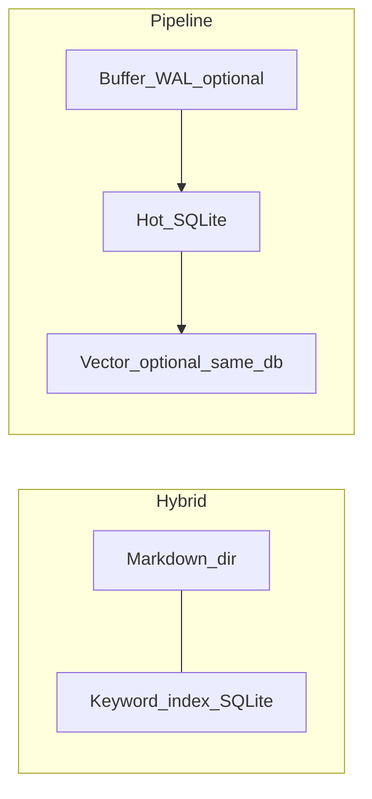

# Memory notes

## `Workbench /setup` (TTY)

After model credentials, setup offers:

- **Skip** — keep JSON as-is  
- **`memory.backend=noop`** — disable persistent recall  
- **Markdown preset** (`hybrid`) — Markdown under `memory.path` plus a sibling **keyword index** (SQLite, `*.hot.db`). Default **highlight** in the menu.  
- **Remote embeddings** (`pipeline`) — OpenAI-compatible `embedding_base_url` + model; embeddings reuse **`llm.api_key`** unless you edit JSON later.  
- **Local ONNX** (`pipeline` + `embedding_provider=local`) — only if the binary is built with **`--features embedding-local`**.

**Not surfaced in setup:** `file`‑only backends and **`pipeline` without embeddings** — edit `~/.anycode/config.json` instead.

## Lightweight alternative: pure `file`

若只要目录 Markdown、**不想要** Hybrid 自带的旁路索引，仍可手动设 **`memory.backend: file`**（JSON 默认值即 `file`）。Setup 主推 Hybrid 作为主目录 + 检索体验。

## Hybrid vs pipeline

| | **Hybrid (`hybrid`)** | **Pipeline (`pipeline`)** |
|---|------------------------|----------------------------|
| Primary store | Markdown 根目录 | 归根通道 hot 层（SQLite）+ 可选只读并入 legacy `*.md` |
| Extras | 旁路 **关键词索引**（`*.hot.db`） | 可选 **缓冲 + WAL**，晋升钩子， autosave ingest |
| Vectors | 无（Setup 中选向量会切到 pipeline） | 可选向量索引（与热层共用 `*.pipeline.hot.db`）+ HTTP / 本地嵌入 |



## Current backends (reference)

`memory.backend`: `noop` | `file` | `hybrid` | **`pipeline`** (aliases: `layered`, `guigen`).

With **`pipeline`** and `merge_legacy_file_recall` (default true), existing `*.md` under the memory root merge **read-only** into recall.

**Autosave**: `memory.auto_save` + runtime hooks. With **`pipeline`**, autosave **ingests** into the ephemeral buffer before promotion.

Optional `memory.pipeline` fields include: `buffer_ttl_secs`, `max_buffer_fragments`, `promote_touch_threshold`, `reinforce_on_recall_match`, `merge_legacy_file_recall`, `buffer_wal_enabled`, `buffer_wal_fsync_every_n`, `hook_after_tool_result`, `hook_after_agent_turn`, `hook_max_bytes`, `hook_tool_deny_prefixes`, `embedding_enabled`, `embedding_model`, `embedding_base_url`, `embedding_provider`, `embedding_local_cache_dir`.

## WAL & vectors

- **WAL**: When `buffer_wal_enabled`, buffer state appends to `*.pipeline.buffer.wal` beside the hot DB; replayed on startup; `fsync` per `buffer_wal_fsync_every_n` and on bridge / task checkpoints.
- **Vectors**: Enabled when pipeline embedding fields / `embedding_provider` request it; stored in the same `*.pipeline.hot.db` as the hot layer (a separate `*.pipeline.vec.sled` before DATA-02). See project docs for `--features embedding-local`.

**Migrating old data**: since 0.42.1 the hot layer / vectors moved from sled to SQLite. A binary built with `--features sled-migrate` copies existing sled data once, on first open of an empty database; regular release builds ship without sled.

**CLI import**: `anycode memory import [--dry-run] [--limit N]` imports legacy Markdown into pipeline hot (`memory.backend: pipeline`).

## Auto-memory (`memory.automem`)

LLM-driven **auto-memory** runs alongside the local pipeline/hybrid engines:

- **Layout**: `{memory.path}/projects/{sanitized-cwd}/memory/` with index entry **`MEMORY.md`** (≤200 lines / ≤25KB).
- **Extraction**: a forked sandboxed agent reads session transcripts and consolidates in four phases (orient → gather → consolidate → prune/index).
- **Gating**: autoDream time/session thresholds + mutex + cursor; skips fork when the main agent already wrote memory directly.
- **Fallback**: when `enabled=false` or no LLM is available, falls back to dedup/promote/forget + vector recall.

Example config (`~/.anycode/config.json`):

```json
{
  "memory": {
    "automem": {
      "enabled": true,
      "fork_agent": true,
      "dream_min_hours": 24,
      "dream_min_sessions": 5
    }
  }
}
```

Set **`ANYCODE_DISABLE_MEMORY_PERIODIC_RESYNC`** to disable periodic multi-store resync.

## OpenClaw parity (research backlog)

Same checklist as before: write triggers, retrieval strategy, compaction interaction — track outside the CLI binary.

## Related

- [Architecture](./architecture)  
- [Config & security](./config-security)
